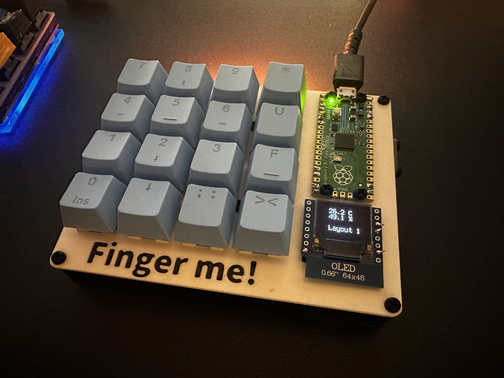

# DIY Macropad

## Features:
- Fully programmable (CircuitPython)
- OLED display for sensor data (temperature, humidity)
- Neopixel rainbow color animation
- 3D printable case (STL files in `STL` directory)

## Parts List:
- Raspberry Pi Pico
- SHT31-D temperature and humidity sensor
- SSD1306 Display (64 x 48)
- Mechanical switches and keycaps
- Diodes for each switch (for matrix scanning)
- Neopixel RGB LEDs (optional for backlighting/animations)

## 3D Print:
- Download STL files from the `stl` folder.
- Use [Onshape design](https://cad.onshape.com/documents/2d162565275ddd8e54fc1bd9/w/c47f0c507d79665ec89cd9d3/e/1a384d2216d29f9fbab43cf1?renderMode=0&uiState=66eb204116019f4d8a150737) for adjustments.

